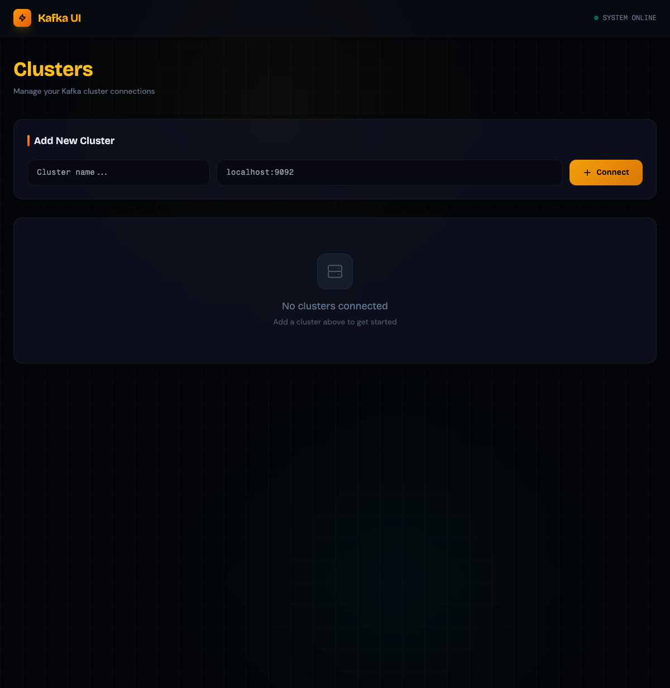

# Kafka UI Rust

A lightweight, fast Kafka management Web UI built with **Rust** (Axum + rdkafka) and **React** (Vite + Tailwind CSS).

Inspired by [Kafbat UI](https://github.com/kafbat/kafka-ui), but with a single-binary deployment and a dark industrial data-terminal aesthetic.



## Features

- **Cluster Management** — Add, list, and delete Kafka clusters
- **Topic Browser** — List topics with live message counts, search, pagination, create/delete topics
- **Topic Detail** — View partition info, ISR, leader distribution
- **Message Explorer** — Fetch messages from any partition or all partitions with cursor-based pagination
- **Produce Messages** — Send messages with optional partition and key
- **Consumer Groups** — List consumer groups and view partition lag
- **Single Binary** — Frontend is embedded into the Rust binary; no separate web server needed
- **Persistence** — Cluster configurations are saved to `data/clusters.json`

## Prerequisites

- [Rust](https://rustup.rs/) (1.80+)
- [Node.js](https://nodejs.org/) (20+) — only for building the frontend
- [CMake](https://cmake.org/) — required by `rdkafka` (via `cmake-build` feature)
- A running Kafka cluster (tested with Kafka 2.x / 3.x)

## Quick Start

### 1. Clone & Build

```bash
git clone https://github.com/YOUR_USERNAME/kafka_ui_rust.git
cd kafka_ui_rust

# Build frontend
cd frontend
npm install
npm run build
cd ..

# Build release binary
cargo build --release
```

### 2. Run

```bash
./target/release/kafka_ui_rust
```

Open your browser at **http://localhost:8080**.

### 3. Add a Cluster

Click **"Add Cluster"** on the home page, enter your Kafka bootstrap servers (e.g. `localhost:9092`), and save. The cluster config is persisted to `data/clusters.json`.

## Development

Run backend and frontend separately (with hot-reload):

```bash
# Terminal 1 — Backend
cargo run

# Terminal 2 — Frontend
cd frontend
npm run dev
```

The Vite dev server proxies `/api` requests to `http://localhost:8080` automatically.

## Project Structure

```
.
├── Cargo.toml          # Rust dependencies
├── src/
│   ├── main.rs         # Axum server + static asset embedding
│   ├── api/            # API route definitions
│   ├── cluster/        # Cluster CRUD handlers & models
│   ├── topic/          # Topic & message handlers
│   ├── consumer/       # Consumer group handlers
│   ├── kafka/          # rdkafka client wrapper
│   ├── static_assets.rs# Frontend dist embedding (rust-embed)
│   └── state.rs        # Shared app state
├── frontend/
│   ├── package.json
│   ├── vite.config.ts
│   └── src/            # React pages & components
└── data/
    └── clusters.json   # Persisted cluster configs
```

## Tech Stack

| Layer | Tech |
|-------|------|
| Backend | Rust, Axum 0.8, Tokio, rdkafka 0.37 |
| Frontend | React 19, Vite, TypeScript, Tailwind CSS v3, TanStack Query v5 |
| Embed | rust-embed, mime_guess |

## License

MIT
